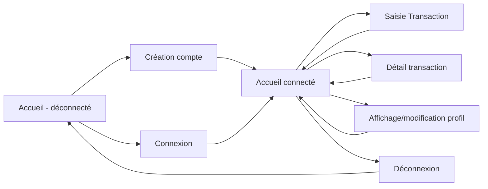

# FinPerso l'appli de gestion des finances personnelles

Il s'agit d'une application personnelle qui permet de :
* Ajouter / Modifier / Supprimer une transaction
* Afficher l'historique des transactions
* Afficher des graphiques des dépenses par catégories

Le code existant contient les briques de bases et le fonctionnement initial.

Pour continuer le travail, il faut suivre les instructions communiquées durant le cours ou bien l'épreuve.`

## Flow et navigation de l'application

Voici le flow à suivre : 

Le Fronstend sera mobile-first.
